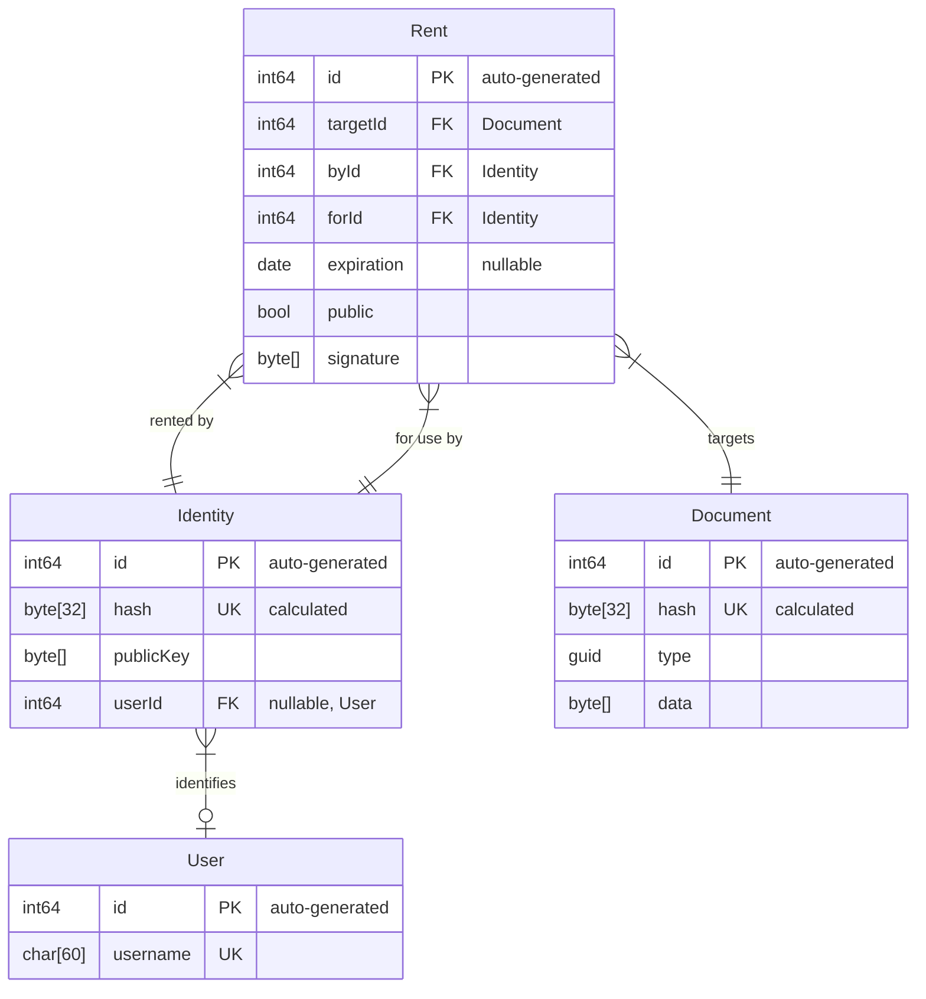

Simple Collab Protocol
======================

The goal of the _Simple Collab Protocol_ is to allow a users to (a)synchronously
synchronize documents with a group of other _trusted_ users. The synchronization
process is mediated by one or more _untrusted_ servers, which treat each user as
_untrusted_ clients.

In simpler terms: this protocol allows a user Alice to upload a document to one
or more servers in the cloud, without revealing the contents of anyone. Alice
can decide to share her document with another user Bob. Bob can at this point
download Alice's document from the servers and, if Alice gave Bob permission,
edit it and upload back his modifications, enabling Alice to later check out
Bob's changes. All of this may happen in real-time as Alice and Bob work on the
same document at the same time, or with a delay if Alice and Bob are not online
when the other is working on the document. The only requirement is that when
Alice decided to initially share her document with Bob, she must have previously
received Bob's key (a QR-Code) directly from him or from a trusted third-party.

These documents may be any kind of documents, such as snippets of text or code,
or paint canvases, or even chat messages exchanged between a group of users.

At the current version, users share RSA keys signed and encrypted through
Ed25519. The RSA keys are then used to encrypt shared documents, which are
signed again with the asymmetric key. All hashes mentioned in this protocol are
SHA-256. All binary data is transferred as base64url (RFC 4648 §5).

> [!NOTE]
> I would have much preferred a post-quantum cryptographic algorithm, but
> unfortunately I am not aware of any with small enough signatures at the time.
> We'll see in the future if something adequate will emerge, although my
> expectations are low given the current situation.


## Definitions

**Document** - Some piece of data, could for instance be a snippet of text, an
image, a rich-text document, a file, a message, a generic blob of bytes, etc...

**Synchronous** - In real-time; multiple people synchronously collaborating on
the same document means they are all working on it at the same time.

**Asynchronous** - In deferred time; multiple people asynchronously
synchronizing a document means they connect to download the current most updated
version, disconnect, apply some changes while offline, re-connect, and re-upload
a new version which includes their changes.


## Goals

**Simplicity** - The main goal of this protocol is to help users
(a)synchronously synchronize encrypted documents, nothing more, nothing less.

**Compatibility** - This protocol can be adopted by clients written in any
programming language and for any hardware, in particular web-apps running in the
browser. The standard implementation of this protocol is compatible with HTTP.

### User Goals

**Privacy and Security** - The servers never sees unencrypted documents, thus
they are immune to security issues and leaks. Only authorized users may decrypt
documents locally through their private keys after downloading them from the
servers. This is called _end to end encryption_, and it allows the clients to
treat the servers as untrusted relays.

**Anonymity** - Each user is identified by their public key. Servers don't need
to know which users belong to which real-world people or entities. Users do not
know about other users unless they know their public key. Users only know about
documents which have been shared with them.

**Redundancy** - Users may decide to synchronize their documents to multiple
servers, thus ensuring that their documents will still remain available even if
one or more of these servers are taken offline.

**Efficiency** - If data is shared between multiple versions of the same
document, it is not repeated and doesn't need to be re-synchronized every time.

**Permissions** - When sharing a document, users may decide to share as
read-only, read-write, or with full permissions. Read permission implies
allowing to create personal copies of the document. Full permissions means
read-write + changing other user's permissions. Changing other user's
permissions implies allowing to delete the document by revoking all user's
permissions including oneself's, and implies allowing to share the document with
new users.

**Discovery** - Users may ask the server for a list of all documents which have
been shared with them.

### Server Goals

**Quotas** - Every record is tied to one or more users, therefore the servers
can trivially track the amount of data stored by each user, apply a limit on the
quota, and thus avoid storage-exhaustion.

**Eviction** - Since every record is tied to one or more users, this protocol
allows the servers to trivially delete all records that are no longer in use
once a user is deleted or expires.

**Expiration** - Servers can track which users acknowledged obsolete versions of
each document, and may delete them after a certain period of time.

**GDPR Compliancy** - Since servers do not store any PII, any standard server
implementation of this protocol should comply, out of the box, with all GDPRs.

## Non-Goals

Since all operations are secure and it's not necessary to trust the servers, and
thus, TLS is not strictly required. It is still recommended to configure TLS,
especially if the server is exposed publicly. It is out-of-scope of this
protocol to provide secure means to ensure the clients are communicating with
who the server claims to be, but this protocol makes it mostly unnecessary.

It is not the goal of this protocol to provide a way to execute high-performance
queries in a document-oriented database fashion. Each operation involves
encryption, and some operations imply signature validations which may be
particularly slow in some environments. The goal of this protocol is just to
provide synchronous or asynchronous synchronization capabilities, not to provide
high-performance distributed storage or data-streaming.

While this protocol allows users to assign a certain level of permissions when
sharing documents, nothing forbids a read-only user to make a writable copy of
a document they received. Also, users with full permissions may at any time
revoke other users' permissions, including the user that originally shared the
document with them. When users' permissions on a document are revoked, this
protocol allows those users to fork the document and continue working on a copy
of the document at the last point before their permissions have been revoked.

Users with any permissions on a document may be able to know the public key of
all other users with whom that document has been shared. This does not break
anonymity on its own, as users do not know who the other users are unless they
know who their public key corresponds to. To avoid leaking the public keys of
other users, the owner might decide to share different copies of the same
document with each user, but if one of the users will edit the document, other
users will not be aware of the modifications, therefore, this workaround only
works well when sharing a document as read-only.

If a user knows the hash of a document, they can ask the server for it, and the
server will provide it without any further verifications. Still, the contents of
the document will not be accessible unless the user knows the key do decode it.

To help track the amount of data each user is consuming, this protocol does not
hide which users have access to which documents, therefore the server knows
which users have connections with which others. As a workaround on servers that
allow registering users anonymously, it's possible to create a new user for each
shared document.

This protocol does not provide complete anonymity on its own, but it may still
be possible for a user to hide their identity by accessing the servers through
anonymity networks such as Tor or I2P.

A future revision of this protocol may allow federation between servers, but not
the current version.


## Entities

Unless otherwise noted, all the columns described in this document are
immutable. This means that once a record has been added to the database, the
value of most columns may never be updated.

It's possible to delete records provided that no FK constraint prevents it.

Specific server implementations may decide to add additional mutable and
immutable columns.



### User

Represents a known user, associated to a subject (person).

The `id` is only used internally and servers do not disclose it to clients.
Each server may use a different id for the same user.

Public servers may allow registering users by `username`, as a convenient way
to identify subjects by an alias rather than by a public key.

Users with the same username on different servers may or may not represent the
same subject. This means that the same username may be used by different people
on different servers.

Users authenticate through the key associated to their identities, therefore a
user must always have at least one associated identity.

### Identity

Represents a public identity, possibly associated with a user by `userId`. 

The `id` is only used internally and servers do not disclose it to clients.
Each server may use a different id for the same identity.

Instead, clients identify identities by the `hash` of their public key.

When a new identity is registered, a new set of `publicKey` + private key is
generated. The public key is shared with the servers and stored on their
database, while the private key is kept secret locally by the owner.

Identities not associated with any user (anonymous identities) may be subject to
garbage-collection at any time, while identities associated to a certain user
may not be garbage-collected for as long as the user is active on the server.
This implies that, as long as the user authenticates to a certain server once
very few days, their data may not be evicted from that server without warning.

### Document

Represents a document (a message, an event, a partial or complete document).

The `id` is only used internally and servers do not disclose it to clients.
Each server may use a different id for the same document.

Instead, clients identify documents by the `hash` of their type + data.

The `type` is a GUID and can be used by clients to filter only documents that
they can actually understand.

The `data` is an arbitrary blob of bytes associated with the document.

### Rent

Prevent a document `targetId` from being garbage-collected.

The `id` is only used internally and servers do not disclose it to clients.
Each server may use a different id for the same rent.

Each rent can be requested by an identity `byId` for use by an identity `forId`,
which may or may not be the same.

Optionally, an `expiration` date may be set, after which the document may become
eligible to garbage-collection again.

When the requester and the "for use by" identity are the same, the rent may be
marked as `public`. Public documents are publicly enumerable by identity.

The identity that requested the rent must apply a `signature` to the hash of the
target document + hash of the "for use by" identity + the expiration (if any).

The identity that requested the rent can at any time revoke the request. As long
as the rent is valid, the document is counted towards the quota of the
requesting identity, and not towards the quota of the "for use by" identity.

Every identity may at any time create a new rent request for any document, even
if the document was not originally created by them. Renting a document causes it
to immediately start couting towards their quota, and prevents it from being
garbage-collection.


## API

> [!WARNING]
> All API refer to a previous version of the protocol and thus do not fully make
> sense anymore. Please ignore this section for now.

Clients can interact with servers through the HTTP REST API.

Some operations require a _Proof of Work_ (PoW) to reduce the risk of spamming.
For these requests, a `X-Collab-PoW` header must be included, the value of this
header must be a base64uri-encoded sequence of bytes, that when concatenated
with the SHA-256 hash of other significant parts of the request, must result in
a sequence of bits starting with with N zeroes.

`{PoW 24 on the public key}` means that the public key is hashed, and to the
hash the client must concatenate a sequence of bytes that when hashed results in
a hash starting with 24 bits set to zero. Binary data is hashed as bytes, text
data is hashed as UTF-8 bytes.

JSON responses are only indented for better reading, responses from standard
implementation servers are not indented, and do not contain comments.
Additional fields may be included, clients should ignore unknown fields.

All endpoints may return a response like the following in case of error.
Standard error codes are documented, but custom server implementations are
allowed to add application-specific error codes.

```http
HTTP/1.1 400 Bad Request
Content-Type: application/json

{
  "error": "string",             // Error code.
  "error_description": "string", // Human-readable description (optional).
  "error_uri": "string"          // Link to the documentation (optional).
}
```

### Error Codes

`"missing_pow"` - The `X-Collab-PoW` header is missing.

`"invalid_pow"` - The PoW is not valid or doesn't contain a sufficient number of
initial bits set to zero.

### User Create

Ask the server to create a new user.

#### Request

```http
POST /api/v1/usr HTTP/1.1
Content-Type: application/json
X-Collab-PoW: {PoW 26 on the public key}

{
  "public_key": "string" // Public key in base64url format.
}
```

#### Response

```http
HTTP/1.1 200 OK
Content-Type: application/json

{
  "hash": "string" // Hash in base64url format.
}
```

#### Example

```http
POST /api/v1/usr HTTP/1.1
Content-Type: application/json
X-Collab-PoW: TODO

{
  "publicKey": "5uUg7dmfzRLUJmfq2xt8GOTHkjuD6iVttcL0wrGpgOc"
}

HTTP/1.1 200 OK
Content-Type: application/json

{
  "hash": "V7hZQY0g61dMbywtkhZyIkXnU-wNBENi9xFFSX0qzTs"
}
```

### User Read

Ask the server for information about a user.

#### Request

```http
GET /api/v1/usr?u={hash}
X-Collab-Pow: {PoW 22 on the hash}
```

#### Response

```http
HTTP/1.1 200 OK
Content-Type: application/json

{
  "public_key": "string" // Public key in base64url format.
}
```

```http
HTTP/1.1 404 Not Found
Content-Type: application/json

{
  "error": "unknown_user"
}
```

#### Example

```http
GET /api/v1/usr?u=V7hZQY0g61dMbywtkhZyIkXnU-wNBENi9xFFSX0qzTs HTTP/1.1
X-Collab-Pow: TODO

HTTP/1.1 200 OK
Content-Type: application/json

{
  "public_key": "5uUg7dmfzRLUJmfq2xt8GOTHkjuD6iVttcL0wrGpgOc"
}
```

### User Info

Ask the server for information about your user.

#### Request

`hash` is the hash of your user.

The `timestamp` is the current UNIX timestamp (seconds since 1970-01-01 UTC),
and signature is the string `"REQUEST_USER_INFO:{timestamp}"` with the correct
value for `{timestamp}`, signed with your private key.

There is a bit of tolerance to compensate for clock drifting, but if your device
does not have an accurate clock you can use the timestamp returned by the
_/api/v1/info_ endpoint which is always aligned with the server's.

```http
GET /api/v1/me?u={hash}
X-Collab-Pow: {PoW 22 of the proof}
X-Collab-Proof: {timestamp};{signature}
```

#### Response

The `expiration` date is extended automatically every time the user performs
an operation. May be null if the user never expires.

```http
HTTP/1.1 200 OK
Content-Type: application/json

{
  "quota": 1234,     // Approximate number of bytes allowed.
  "used": 1234,      // Approximate number of bytes used.
  "expiration": 1234 // Expiration timestamp of this user (may be null).
}
```

```http
HTTP/1.1 404 Not Found
Content-Type: application/json

{
  "error": "unknown_user"
}
```

```http
HTTP/1.1 400 Bad Request
Content-Type: application/json

{
  "error": "invalid_timestamp"
}
```

```http
HTTP/1.1 400 Bad Request
Content-Type: application/json

{
  "error": "invalid_signature"
}
```

#### Example

```http
GET /api/v1/me?u=V7hZQY0g61dMbywtkhZyIkXnU-wNBENi9xFFSX0qzTs HTTP/1.1
X-Collab-Pow: TODO
X-Collab-Proof: 1742056204;tQWFcFBiU4QIp69mnWk423gmC7rKHqWxmcMPNTGtKdzG_c2ojL1NSRBiIPQPt5nPMqxeffAq5jSI8XPZNyelBw

HTTP/1.1 200 OK
Content-Type: application/json

{
  "quota": 10485760,
  "used": 1263616,
  "expiration": 1750001404
}
```

### Document List

Ask the server for documents of a specific set of types.

The `types` are encoded as a list of base64uri separated by `+`.

If `include_new` (optional) is set to `1`, new documents received from other
users are included in the results. Once documents have been acknowledged, they
will no longer be considered new.

If `watch` (optional) is set to `1`, the connection will remain open until new
documents matching the requested type are received. Only unacknowledged
documents are returned by this query.

If too many documents are available by this query, a new query can be repeated
with the `cursor` returned by the previous query to continue reading the next
page of documents.

#### Request

```http
GET /api/v1/docs?u={user}&t={types}&n={include_new}&w={watch}&c={cursor}
X-Collab-Pow: {PoW 22 on the hash}
```

It is also possible to use web-sockets to listen for new documents, each
document emits a separate message.

> TODO: web-socket request.

#### Response

```http
HTTP/1.1 200 OK
Content-Type: application/json

{
  "hashes": ["string"], // Array of document hashes.
  "cursor": "string"    // Cursor (may be null).
}
```

> TODO: web-socket response.

```http
HTTP/1.1 404 Not Found
Content-Type: application/json

{
  "error": "unknown_user"
}
```

#### Example

```http
GET /api/v1/docs?u=V7hZQY0g61dMbywtkhZyIkXnU-wNBENi9xFFSX0qzTs&t=vU34qp3cRrCr6w4xcC1fYg+NeMnVebvRhO_CmR-LWrP9w HTTP/1.1
X-Collab-Pow: TODO

HTTP/1.1 200 OK
Content-Type: application/json

{
  "hashes": ["IotIpW28Ls8QOTInrJydyUOIH9elVFLhKgkQdHa-8rI", "X7FnnghnQFm3LicdiQLBGhJ7tTAbBV3Hf6A5Mq2lalY"],
  "cursor": null
}
```

> TODO: web-socket example.

### Document Read

> TODO: define.

When a document is read for the first time, it implicitly becomes acknowledged.

> TODO: define.

### Document Acknowledge

> TODO: define.

### Document Create

> TODO: define.

### Document Delete

> TODO: define.

### Server Info

> TODO: define.

> TODO: include `timestamp` with current server date.


## Extensions

That's all there is to this protocol. It should provide all the basic building
blocks necessary to build all sorts of different applications.

Applications based on this protocol may adopt a common set of standardized
functionalities, thus sparing the user from having to learn a different way to
do the same thing in different applications.

Some of these functionalities are defined here. If this protocol will ever
become popular, the community is expected to come up with new ideas which will
eventually become mainstream, and eventually standard.

### Authentication

A basic client application is expected to generate a private key + public key
pair for the user, and allow them to store it in a local persistent storage.

The problem is that users are not familiar with asymmetric keys and may not
fully understand how to use them effectively. The average user expects to be
able to login through usernames and passwords, and expects to be able to change
their password, as well as to recover a forgotten password.

Instead of generating the keys pair purely from randomness, a client application
can ask the user for a username and a password and use scrypt to derive the
32-byte seed used to compute the Ed25519 keys pair.

The exact formula is:
`scrypt(pwd: sha256(password), salt: sha256(username), N: 8192, r: 8, p: 1, dkLen: 32)`

The result is the private key used to create a new "ghost" identity, renting a
public document of type `6e377e33-a218-4236-ae50-a4249a94d365`. This document
contains another private key, such as the following, encrypted with the "ghost"
identity's private key.

```json
{
  "private_key": "PCnrDB5uOvg_ubQcmE0wH4Ob1sYB-ylFCU9u0L0a7yI"
}
```

This private key is the real the Ed25519 private key for another identity, from
which the public key can be derived.

When the user wants to change password, a new "ghost" identity is generated, and
the old one may be deleted. The new "ghost" identity will contain another
document identical to the previous one, containing the same private key, but
encrypted with the new "ghost" identity's key.

As a password recovery mechanism, during the initial registration of a new user,
and optionally at any time after inserting the correct username + password pair,
the user is allowed to download a list of 24 words from the BIP-39 list.
These 24 words can be used to re-generate the real private key, and thus serve
as a backup mechanism alternative to the password.

### Encryption

As an example, we wish to share an encrypted "data" document with one or more
identities.

For each identity choose a role between:
- `R` read
- `W` read + write
- `A` read + write + change permissions

Generate a new RSA key.

Generate a new set of "permissions" in the form of a document of type
`e791d538-6fe4-4226-b3ec-29a4f93d2949`, containing the hash of "data" document,
the hash of the users you want to share it with, and their permissions, then
encrypt it with the new RSA key, the unencrypted content must be as follows.

```json
{
  "document": "u4d9x6PFfkoDPvPN8ghfX4yLFgbaSdtxD0R4lPs8dqI",
  "identities": {
    "CrcV-NsSb6E3pncR9ME3aYIhkztE40-60CkfPdBWmqk": "A",
    "auhvDQnZQ9X7PBhU7YflDfh91YOUBkBVJ16ntuOhgKo": "W",
    "X74WrntNfgxf-wOdkUUyF_RV54bH7R0VVFVPZ86VFQU": "R",
    "VipIjMsUY4NIEmgMkRk6hYv5I5b7-W8PyHUwWynmK_4": "R"
  }
}
```

Encrypt the RSA key with the public key of each identity

For each identity you want to share the "data" document with, create a new
document of a type specific for your application, and create a short-lived rent
(suggested: 50 days) for it, "for use by" the identity you are sharing with,
then encrypt it with the public key of each identity. The unencrypted content
must be as follows. The target is the hash of the "permissions" document.

```json
{
  "key": "(the RSA key)",
  "target": "1m0bckrLlIu6Je6IG2xs4W79bHSRW_Z_N8hH2KyGHfk"
}
```

Whenever an identity with `A` or `W` permissions wishes to share an update to
the document, the recepients will verify that the permissions match, and if not,
will treat the update as a new unrelated document.

To share an existing document with a new identity it is not necessary to
generate a new RSA key, but when revoking permissions it is.

### Contacts

User contacts may be encoded as documents containing the user's name and their
public key.

Applications may use documents of type `f12e98dc-7de1-444a-b5b1-85451bba0217` to
encode user contacts. When an application shows the user an interface to share a
document with another set of users, it should query documents of this type and
treat each result as a contact pulled from a contact list.

It is also possible to share contacts with other users. These contact documents
are expected to be shared as read-only with just a single recipient at a time.

The unencrypted content of these documents is a vCard 4.0 such as the following:
```plaintext
BEGIN:VCARD
VERSION:4.0
FN:John Doe
KEY;TYPE=collab:5uUg7dmfzRLUJmfq2xt8GOTHkjuD6iVttcL0wrGpgOc
END:VCARD
```


## Open issues

This protocol is still a draft. Ideally I would like to keep it as simple as
possible, while still meeting all the goals. Unfortunately there might be some
potential exploits which could undermine the stability of this protocol. I still
haven't thought about how to patch these vulnerabilities without compromising
too much on the simplicity.

> There are no known open issues at the moment.
